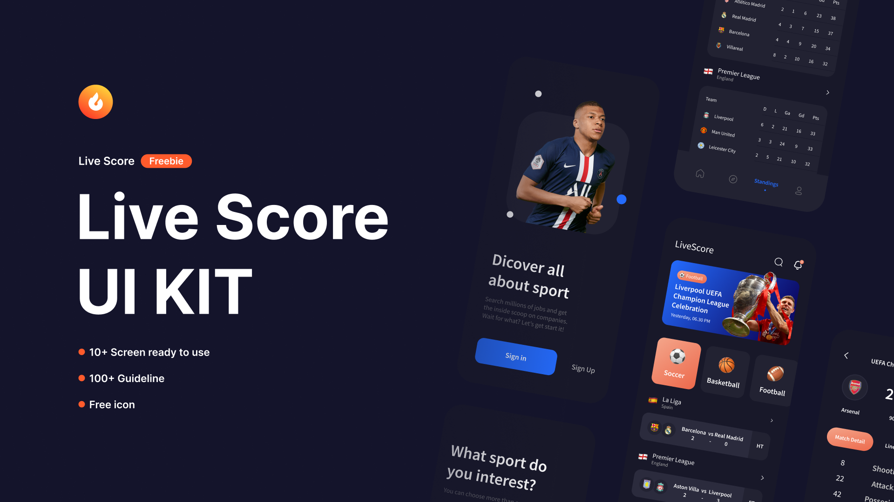

<p align="center">
    
    
    
    
</p>

# Flutter Live Score UI

Flutter Live Score UI is a mobile application developed using Flutter, designed to display live sports scores with a modern and responsive user interface. This project is a result of slicing a design created in Figma, focusing on visual details and delivering an optimal user experience. The app serves as a reference for building live score applications with an attractive UI and high performance.

<a href="https://github.com/sh4dowByte/flutter_ui_live_score/releases/download/v1.0.0%2B1-4/app-release.apk">
    
</a>


## 🎨 Design

The design of this application is based on the provided Figma file. The slicing process was carried out meticulously to ensure the application accurately represents the design.

## 🚀 Feature

- **Responsive Design**: Supports various screen sizes with responsive UI elements.
- **Seamless Navigation**: Implements navigation using Flutter Navigator.
- **Reusable Components**: Modular components for easier development and maintenance.

## 🛠️ Technologies

This project is built using the following technologies:

- **[Flutter](https://flutter.dev/)**: A framework for cross-platform application development.
- **[Dart](https://dart.dev/)**: The primary programming language for Flutter.
- **[Google Fonts](https://fonts.google.com/)**: For custom font integration.
- **[Figma](https://www.figma.com/)**: Used as the application's design reference.

## 📂 Folder Structure

```plaintext
.
├── assets/              # Contains images, icons, and other assets  
├── lib/  
│   ├── config/          # Application configuration (theme, routes, etc.)  
│   ├── screens/         # Main application pages  
│   ├── widgets/         # Reusable UI components  
│   ├── main.dart        # Main application file  
└── pubspec.yaml         # Flutter project configuration  
```

## 🖼️ Screenshot

| 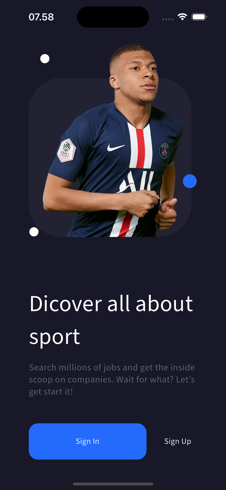                                                                                                     | 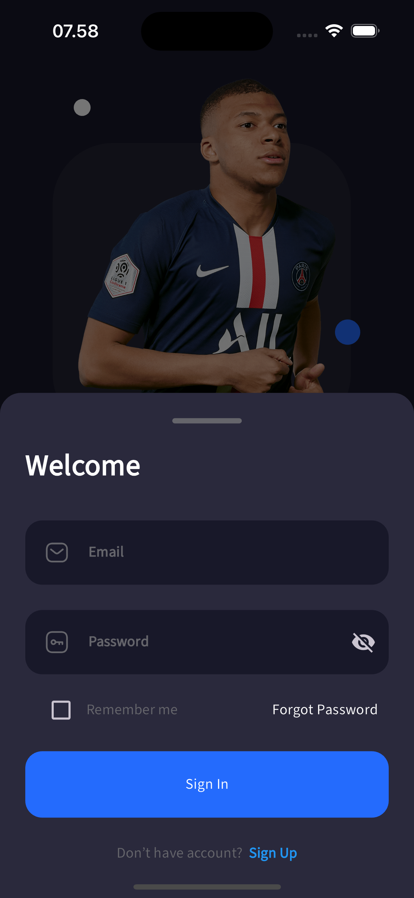 | 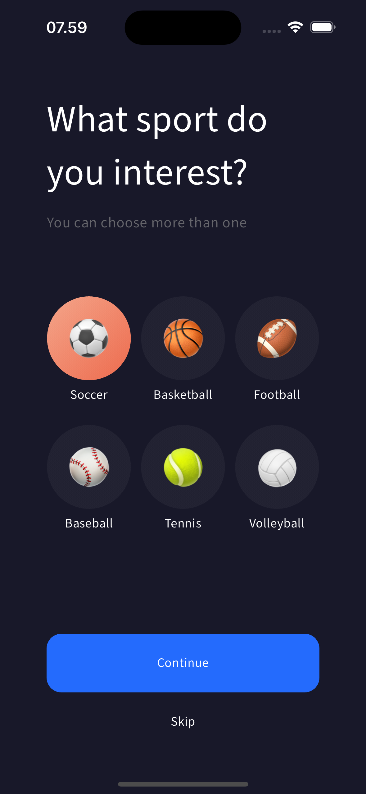 |
| -------------------------------------------------------------------------------------------------------------------------------------------------- | ---------------------------------------------- | ---------------------------------------------- |
| 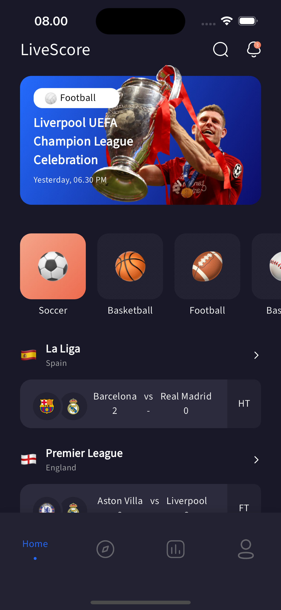                                                                                                     | 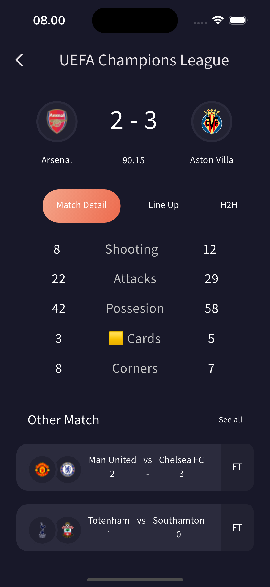 | 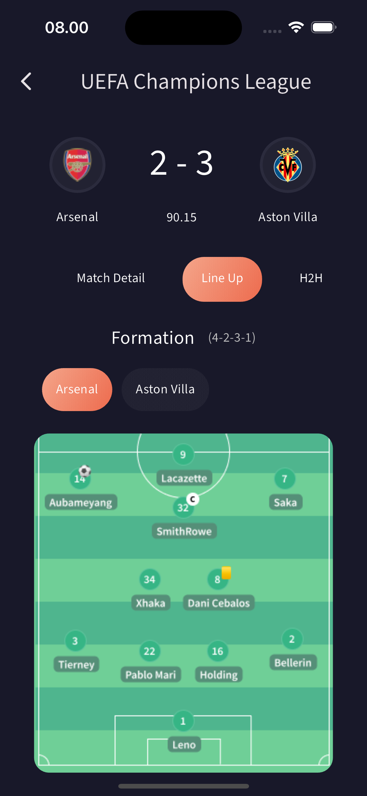 |
| 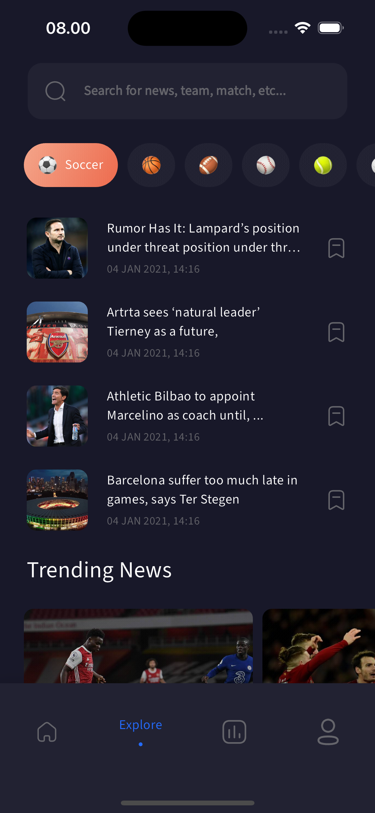                                                                                                     | 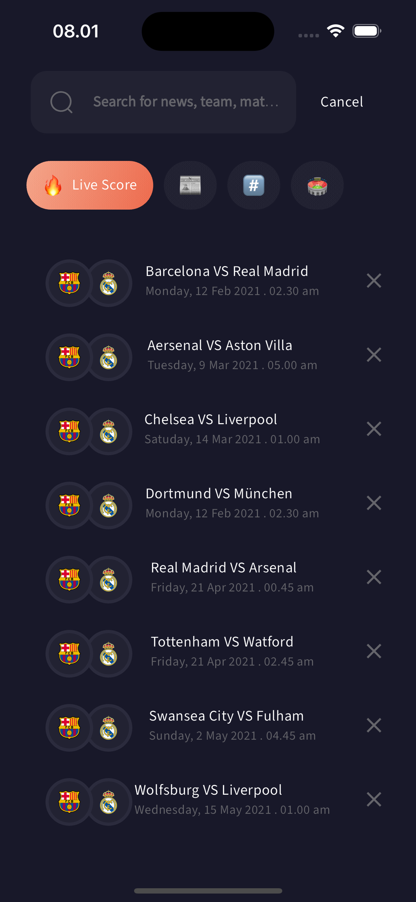 | 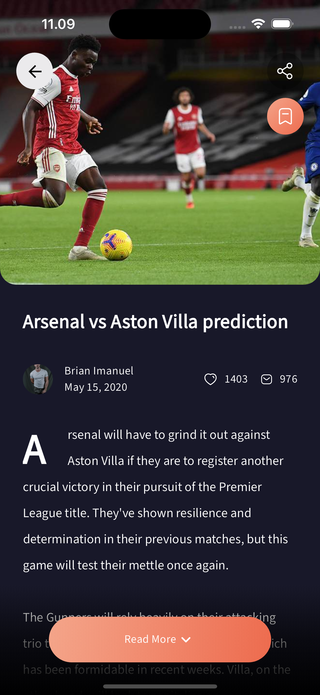 |
| 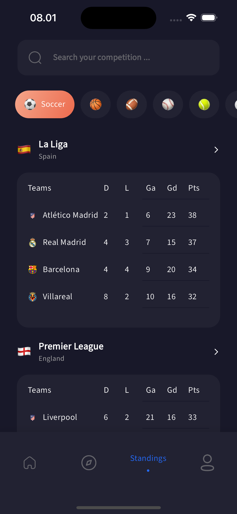                                                                                                     | 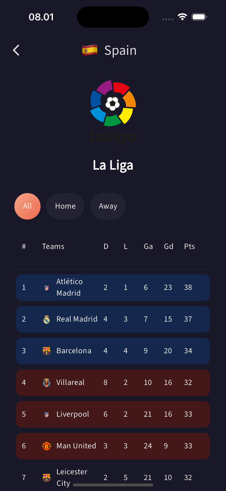 |                                                |
| 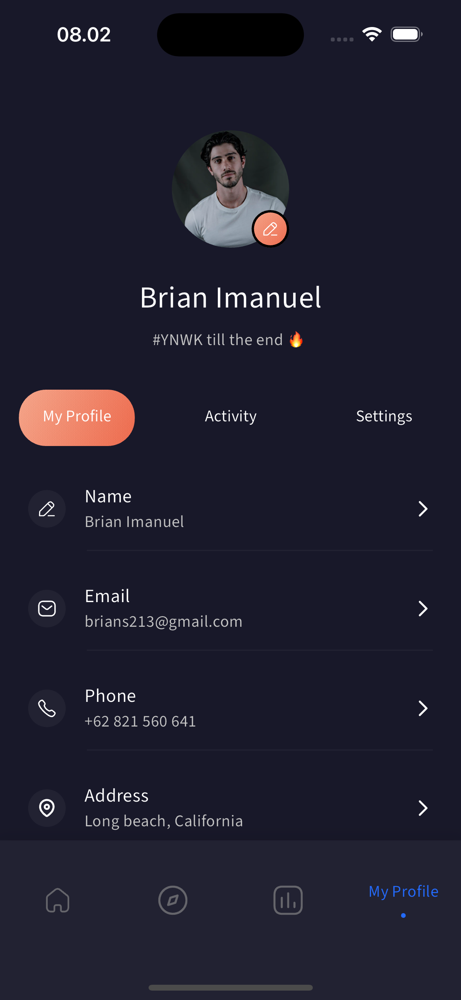 |                                                |                                                |


## License

This project is licensed under the Creative Commons Attribution-NonCommercial 4.0 International (CC BY-NC 4.0).
You are free to use this project for personal or educational purposes, but commercial use is not allowed.

For more details, refer to the [full license text](LICENSE).

## Disclaimer

The design of this application is based on a free Figma template available in the Figma Community, originally created by **[Odama Studio and Rohmad_ K]**. All rights to the original design are retained by the respective creator. This implementation is intended solely for educational and non-commercial purposes.

This project utilizes a design sourced from the Figma Community, created by **[Odama Studio and Rohmad_ K]**. Licensing terms of the original design may apply. Please review the original Figma design [here](https://www.figma.com/community/file/936495139689782604) to ensure compliance with its terms before utilizing this project in any capacity.
